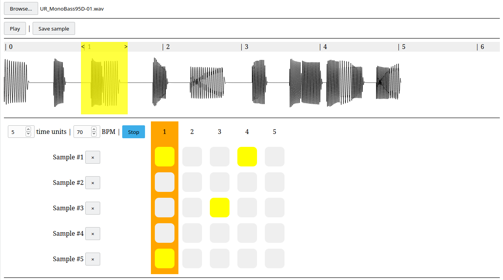

# Vanilla Web Audio API Sampler and Sequencer
Just for fun project for exploring [Web Audio API](https://developer.mozilla.org/en-US/docs/Web/API/Web_Audio_API) functionalities.  
It allows you to load music files (any format supported by modern browsers), extract some segments (sampling) and compose them together with a custom tempo.  
The (very raw) GUI was made with the help of `Vue.js`.

## Screenshot

